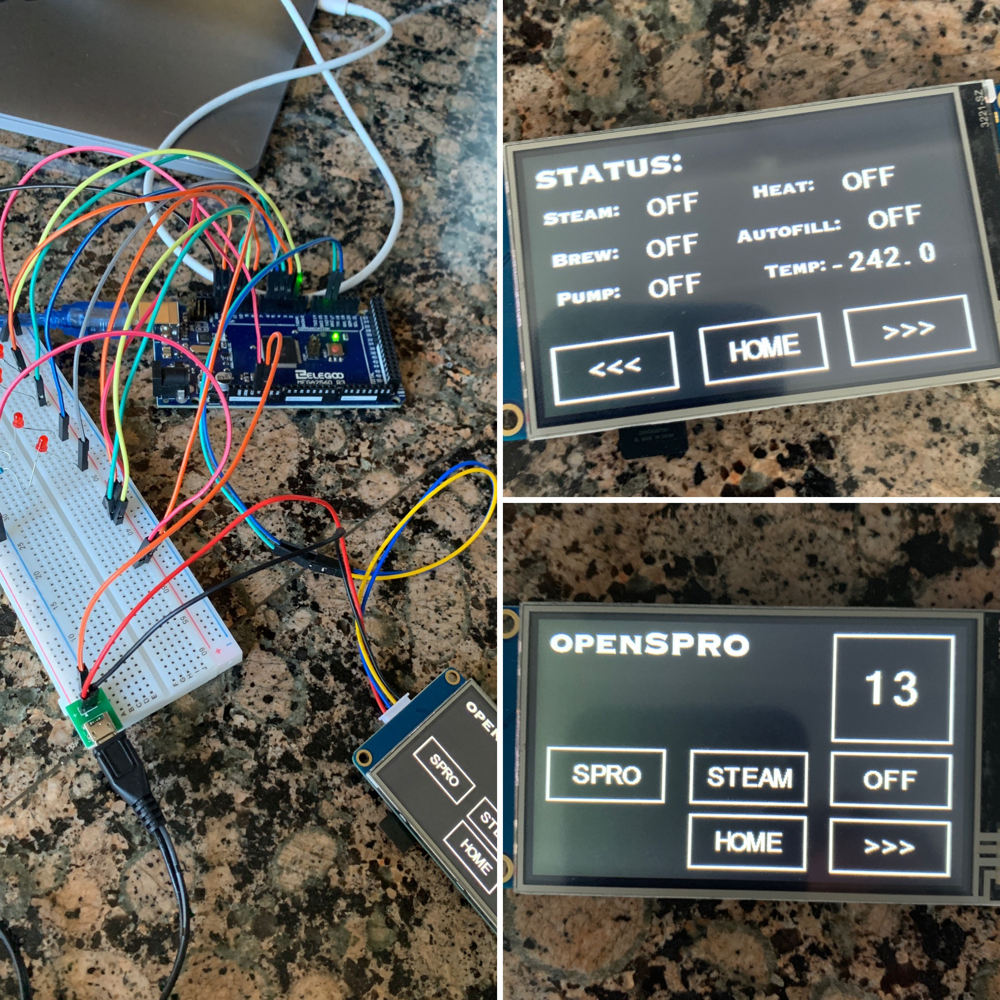

# OpenSproTouchV1
Open Spro is the culmination of the hard work of many.  It is designed to work with the Arduino Mega 2560, but can be easily adapted to other boards.  The display used is a 3.2" Nextion Basic HMI Display.

## Code Contributors

Code for the PID Controller is adapted from:
Barebones Coffee Controller by Tim Hirzel
http://playground.arduino.cc/Main/BarebonesPIDForEspresso#main

Code for the Autofill Controller is adapted from:
Espresso Machine by Anthony Dipilato
http://anthonydipilato.com/2016/07/05/arduino-controlled-espresso-machine/

Code for Momentary push buttons adapted from:
Arduino forum member 6v6gt in post 'Momentary push button and loops'
http://forum.arduino.cc/index.php?topic=375410.0

Nextion Library:
https://github.com/itead/ITEADLIB_Arduino_Nextion

Blink Tutorial, in lamens terms for help with understanding delays without blocking:
http://www.gammon.com.au/blink

Code for the Shot Timer from LeoMil72:
Utilizing his Sec Timer library for Arduino
https://github.com/leomil72/secTimer

Various others whose posts/code have helped me to better understand the Nextion interface

## Features

Current features include:

Full Gicar Fillbox Replacement (Autofill cirucit using PCB SSR and factory water level probe)

Full PID Controller using PT100 RTD Probe and Adafruit MAX31865 Thermocouple Amplifier

Electronic Brew Valve, Pump and Steam Valve Control (Currently via serial interface, buttons to come)

Nextion HMI Display with controls and status screen

## Required Libraries

Nextion -- https://github.com/itead/ITEADLIB_Arduino_Nextion

Sensors -- built in to the code

SPI -- built in to Arduino

## Pinouts for Arduino Mega 2560

### RELAYS

Autofill 3

Heat 6

Brew 4

Pump 5

Steam 2

### MAX31865

CS 10

DI 11

DO 12

CLK 13

### DISPLAY

TX 24

RX 22

### SENSORS

Level 9

### BUTTONS

Brew Button A0

Brew LED A1

Steam Button A2

Steam LED A3
